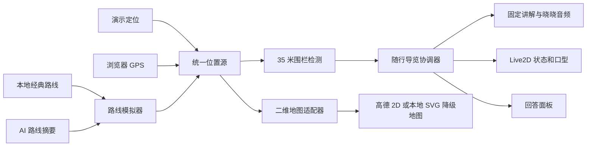

# 数字人实时二维地图与虚拟定位随行讲解设计

当前时间：2026-07-31 10:19（Asia/Shanghai）

状态：已由用户确认

## 目标

在 `/visitor/guide` 的数字人模式中加入实时二维地图、虚拟定位演示、真实 GPS 切换、抵达景点自动讲解和 AI 路线接管能力。比赛现场默认使用本地经典路线和预生成的晓晓女声音频，保证无需等待外部 AI；评委提问产生结构化路线后，可将该路线切换为新的虚拟游览轨迹。

本轮不建设 3D 地图，不修改普通文字模式，不改变现有问答、会话、Live2D 角色、实时语音和 WebSocket 公共协议。

## 已确认的产品决策

- 主要场景是比赛现场大屏电脑。
- 数字人模式采用“左侧数字人，右上实时地图，右下回答面板”。
- 默认使用演示定位，并提供“切换真实定位”按钮。
- 演示控制器提供开始、暂停/继续、1×/2×和重置。
- 进入景点约 35 米范围并连续停留 3 秒后确认抵达。
- 同一景点在一轮路线中只触发一次，重置或换线后才允许再次触发。
- 抵达后自动暂停，完整播放讲解，结束后停留约 1.5 秒再继续移动。
- 讲解使用固定文本和预生成的微软晓晓女声音频；本地音频缺失时展示文本并降级到在线合成。
- 默认播放本地经典路线；AI 返回成功结构化路线后，先预览，再由用户点击“沿此路线演示”。
- 景点讲解完成后保留在回答面板，直到下一次 AI 回答或下一处景点讲解覆盖。
- 首批覆盖六个核心讲解点：九龙灌浴、天下第一掌、祥符禅寺、灵山大佛、灵山梵宫、五印坛城。

## 技术基线与资源选择

项目当前使用 Vue 3、Vite、Vue Router、自建组件、GSAP、Pixi.js 和 Live2D，没有通用 UI 组件库。现有简单过渡与状态动画已足够，本功能不安装 Motion、地图包装库或第二套动画库。

可复用能力：

- `frontend/src/lib/amapLoader.js`：全局复用高德脚本加载 Promise 和配置接口。
- `frontend/src/lib/routeSummary.js`：识别成功的 V2 或旧版路线摘要。
- `frontend/src/composables/useInteractiveMap.js`：提供现有二维地图交互行为参考，但不直接承担随行导览状态。
- `frontend/src/features/digital-human/composables/usePcmAudio.js`：现有实时问答 PCM 播放和音频电平接口。
- `frontend/src/features/digital-human/renderers/Live2DAvatarRenderer.vue`：通过 `state` 与 `audioLevel` 驱动口型和动作。
- `frontend/src/composables/useRealtimeChat.js`：持有最新来源、回答、播放状态和数字人状态。

## 总体架构

采用独立的 `guided-tour` 功能模块，数字人舞台只负责组合展示，不直接实现定位、围栏或路线算法。



模块职责：

- `useLocationProvider`：向下游输出统一位置结构，隐藏演示定位与真实 GPS 的差异。
- `useRouteSimulation`：沿折线按距离插值，处理开始、暂停、倍速、重置和路线结束。
- `useArrivalGeofence`：计算距离、连续驻留时间和单次触发记录。
- `useScenicNarration`：展示固定讲解，依次尝试本地音频、在线合成和纯文字降级。
- `useGuidedTour`：唯一状态机与资源协调者，避免地图、音频和 Live2D 互相直接调用。
- `DigitalHumanTourMap`：高德二维地图与本地 SVG 地图的统一展示组件。
- `TourMapControls`：演示控制、定位来源和路线状态。
- `GuidedTourFallbackMap`：地图服务失败时继续显示路线、光点和景点节点。

## 页面与视觉结构

### 桌面端

数字人舞台最大宽度从当前 `980px` 扩展到适合比赛大屏的约 `1180px`。外层仍保持透明，不形成遮挡风景的大面积实色卡片。

- 左栏约 40%：数字人、角色状态、版权信息和加载错误。
- 右栏约 60%：上方地图占约 58%，下方回答面板占约 42%。
- 两栏间距 20–24px，右栏内部间距 14–18px。
- 地图最小高度约 260px，回答面板最小高度约 150px，整个舞台不遮挡底部输入框。
- 地图卡使用浅色磨砂玻璃、湖蓝描边和低强度阴影；路线使用青绿，当前目标与 AI 预览使用暖金。

地图左上角悬浮紧凑控制器，右上角展示“演示定位”或“真实定位”状态。游客位置使用有方向感的“灵境光点”，抵达计时以环形进度表现，不使用会造成眩晕的旋转或空间透视。

### 平板与移动端

`900px` 以下依次排列数字人、地图和回答面板。地图设置受控高度，回答面板内部滚动，输入框和游客底部导航始终可访问。控制按钮保持至少 44px 点击高度，定位来源文案允许缩写但保留可访问名称。

### 回答面板优先级

回答面板维护两类内容：

1. 最新 AI 回答。
2. 最新景点固定讲解。

景点讲解开始时覆盖显示固定文本，讲解结束后继续保留。下一次 AI 回答产生有效文本时覆盖它；下一景点抵达时则由新讲解覆盖。完整历史仍由现有会话系统负责，不在面板中新增标签页。

## 数据契约

### 统一位置

```js
{
  longitude: Number,
  latitude: Number,
  accuracy: Number | null,
  heading: Number | null,
  speed: Number | null,
  timestamp: Number,
  source: "simulation" | "gps"
}
```

无效经纬度、过期时间戳或非有限数值不向地图和围栏广播。真实 GPS 的 `accuracy` 明显大于触发半径时，仅更新“正在改善定位精度”状态，不累计抵达时间。

### 经典路线配置

经典路线使用版本化 JSON 配置而不是数据库，包含：

```js
{
  schema_version: 1,
  route_id: "lingshan-classic-v1",
  name: "灵山胜境经典文化线",
  default_speed_mps: Number,
  polyline: ["lng,lat"],
  stops: [{
    stop_id: String,
    attraction_name: String,
    longitude: Number,
    latitude: Number,
    trigger_radius_m: 35,
    dwell_ms: 3000,
    narration_text: String,
    local_audio_url: String,
    focus_zoom: Number
  }]
}
```

六个 stop 的顺序固定为：

1. 九龙灌浴
2. 天下第一掌
3. 祥符禅寺
4. 灵山大佛
5. 灵山梵宫
6. 五印坛城

讲解词控制在约 20–35 秒，音频采用同一晓晓音色、相近语速和响度。路线配置、讲解词与音频文件均随应用版本发布，避免运行时由大模型改写。

### AI 路线

继续使用现有 `findSuccessfulRouteSource()` 与 `resolveRouteSummary()`。只有满足以下条件才显示“沿此路线演示”：

- 来源类型为成功的 `amap_route`。
- `polyline` 能解析出至少两个有效坐标。
- 起终点和路线模式存在或可安全回退。

AI 路线先作为暖金预览线，不改变当前定位。用户点击按钮后，模拟器切换到该折线、清空本轮已触发集合并从起点开始。前端把六个核心 stop 与 `/api/visitor/attractions` 返回的已发布景点坐标合并为可触发点：核心点使用审核讲解词和本地音频，其他已发布景点使用公开 `summary` 作为固定回退文本并尝试在线合成。没有坐标、未发布或没有可用摘要的景点不参加自动讲解。纯自然语言路线没有结构化折线时只保留文字，不伪造可执行路线。

## 路线模拟与围栏

### 路线插值

模拟器预先计算折线各段的球面距离和累计距离，通过当前进度换算所在分段，再在线性插值后输出位置。该方式使 1×/2× 只改变行进速度，不依赖点位密度，也不会在稀疏节点之间突然跳跃。

1× 使用配置的演示速度；2× 将逻辑速度加倍。浏览器标签页进入后台后不补跑长时间差，恢复时从暂停位置继续，避免返回页面后瞬间穿过多个景点。

### 围栏规则

- 使用 Haversine 距离计算当前位置与景点中心点的距离。
- 距离 `<= 35m` 开始累计；连续达到 `3000ms` 才触发。
- 离开范围立即清空该景点本次累计值。
- 当前路线已触发 stop 存入 `Set`，暂停不清空，重置和换线清空。
- 同一时刻只允许一个景点进入 `narrating`，相邻围栏重叠时优先选择路线顺序更靠前且距离更近的点。

## 导览状态机与优先级

主状态：

```text
idle → moving → approaching → dwelling → narrating
     → post_narration → moving → completed
```

抵达流程：

1. 进入围栏后显示 3 秒环形进度。
2. 满足驻留条件后暂停模拟器，地图聚焦当前景点。
3. 回答面板切换为景点讲解，数字人状态切换为 `speaking`。
4. 播放本地音频并以分析器 RMS 驱动现有 `audioLevel` 口型。
5. 音频完成后保持文字，停留约 1.5 秒。
6. 恢复模拟器和路线跟随视角。

用户主动问答的优先级高于自动讲解。发送文字或开始录音时，导览暂停并停止当前景点音频，避免与 Qwen PCM 重叠；当前景点仍记为已触发。AI 回答和音频结束后不强制自动恢复，控制器明确显示“已因互动暂停”，由用户继续，防止评委仍在交互时地图自行移动。

## 本地音频与在线合成

本地音频放在数字人静态资源目录下，每个景点一个稳定文件名。首次点击“开始”时调用音频准备方法，满足浏览器用户手势要求。

讲解优先级：

```text
本地晓晓音频 → 在线晓晓合成 → 纯文字
```

在线合成采用独立的白名单接口：核心点只提交 `stop_id`，其他点只提交已发布的 `attraction_id`。后端分别从经典路线目录读取审核讲解词，或从 `AttractionStore` 读取已发布景点的公开摘要，不接受任意文本、草稿景点或客户端覆盖音色。音色固定为 `zh-CN-XiaoxiaoNeural`；只有配置 Azure Speech 凭据时接口才启用。合成结果以音频响应返回并只在当前浏览器会话内复用，不写入会话数据库，也不保存游客位置。

预生成脚本和运行时降级共用同一合成服务，避免出现两套音色配置。讲解词或音频变更必须经过人工试听再入库。

## 地图适配与本地降级

### 高德二维地图

`DigitalHumanTourMap` 复用 `fetchMapConfig()` 和全局脚本 Promise，但独立持有地图、景点标记、经典路线、AI 预览线和游客标记实例。地图固定 `viewMode: "2D"`，不会复用已放弃的沉浸式或伪 3D 逻辑。

地图能力：

- 绘制经典路线和六个讲解点。
- 按位置更新游客光点与方向。
- `moving` 时使用节流后的平滑跟随。
- `approaching` 时突出目标并显示驻留进度。
- `narrating` 时聚焦目标景点。
- AI 路线用暖金色预览，接管后转为当前路线色。
- 销毁时移除全部覆盖物、事件和地图实例。

### 本地 SVG 降级地图

地图配置缺失、脚本加载失败或实例异常时，组件切换到本地景区背景和 SVG 覆盖层。使用经典路线经纬度边界投影为百分比坐标，继续绘制折线、景点节点、游客光点和抵达光环。该降级不缓存或打包高德瓦片，也不声称是实时底图。

AI 路线同样可以投影到 SVG；坐标不足时只显示文字路线状态。地图恢复不在当前巡游中自动热切换，以免销毁和重建导致画面闪烁；重置后可重新尝试加载。

## 生命周期、隐私与可访问性

- 进入数字人模式时准备目录和地图，但不自动请求 GPS。
- 切换真实定位后才调用 `navigator.geolocation.watchPosition()`。
- 切回演示定位、离开数字人模式、页面失活或组件卸载时清除 GPS watch。
- `onDeactivated` 同时暂停模拟器、停止景点音频和清理延迟计时；重新激活后保持路线进度但要求用户继续。
- 不把真实坐标写入会话、数据库、localStorage、日志或分析接口。
- 定位权限拒绝后保留演示模式和当前进度。
- 控制器使用原生按钮、可见焦点、状态文本和 `aria-live`；颜色不是唯一状态表达。
- 遵循 `prefers-reduced-motion`：关闭光环呼吸与平滑缩放，只保留位置更新和短淡化。

## 异常处理

| 异常 | 行为 |
| --- | --- |
| 地图密钥缺失或脚本失败 | 使用本地 SVG 降级地图，路线和围栏继续运行 |
| 经典路线目录失败 | 显示明确错误，禁用开始按钮，不影响文字问答和数字人 |
| 本地音频 404 或解码失败 | 立即保留文字并请求白名单在线合成 |
| 在线合成未配置或失败 | 保留文字，短暂停留后继续路线 |
| 浏览器拦截播放 | 暂停路线并显示“播放讲解”按钮 |
| GPS 权限拒绝或超时 | 保持演示定位，不清空路线 |
| GPS 精度过低 | 不累计围栏驻留，显示正在改善精度 |
| AI 路线坐标不足 | 不显示可执行按钮，只保留文字路线 |
| 用户在讲解时提问 | 停止景点音频并暂停导览，优先完成用户问答 |

## 测试策略

### 纯函数和组合式函数

- 坐标解析、Haversine 距离、累计距离和折线插值。
- 路线起终点、暂停恢复、倍速、重置和后台长时间差保护。
- 35 米边界、连续 3 秒、离开重计、重入和单轮去重。
- 演示定位与真实 GPS 的统一位置契约、精度过滤和 watch 清理。
- 状态机完整顺序、问答抢占、音频结束及 1.5 秒恢复。
- 本地、在线、文字三级讲解降级和对象 URL 释放。
- V2 与旧版路线摘要接管、无效路线拒绝。

### 组件与静态契约

- 数字人舞台包含左侧角色和右侧地图/回答两层结构。
- 地图实例、覆盖物、监听器、计时器和音频均在失活与卸载时释放。
- 回答面板正确显示并保留景点讲解，后续 AI 回答可以覆盖。
- 移动端为数字人、地图、回答的纵向顺序。
- 普通文字模式、独立 `/visitor/map` 和现有共享导航不引用导览内部状态。

### 浏览器验收

- 在 `1520×856` 完整播放六景点经典路线。
- 在 `768×1024`、`390×844` 检查纵向布局、输入框和底部导航。
- 验证开始、暂停、继续、1×/2×、重置和路线完成。
- 验证 AI 路线预览与“沿此路线演示”。
- 拒绝真实定位权限后继续演示。
- 分别模拟地图失败、本地音频缺失和在线合成失败。
- 连续重置并播放至少 5 次，检查地图、计时器、GPS watch、音频和对象 URL 不累积。
- 常规视觉验收使用固定数据和本地音频替身，不调用真实 AI 或付费语音；最后单独执行一次受控真实链路冒烟测试。

## 验收标准

- 点击开始后无需额外操作即可沿经典路线自动巡游。
- 六个讲解点按顺序触发，每轮各一次，无音频重叠和位置跳点。
- 地图、数字人状态、口型和讲解文字同步。
- 用户问答能安全抢占自动讲解，且不会出现两路声音同时播放。
- 高德地图、GPS、本地音频或在线语音任一失败，都不会使数字人页面不可用。
- AI 路线失败或不完整时不破坏默认经典路线。
- 桌面与移动视口无横向溢出，底部输入框始终可访问。
- 不覆盖当前工作区已有的 Live2D、语义动作、实时语音和后端改动。

## 非目标

- 不实现 3D 实景地图、倾斜摄影、空间环绕或地图瓦片离线缓存。
- 不建立全量景点语音库，首批只保证六个核心点。
- 不把游客位置持久化，不新增账号或轨迹历史。
- 不让大模型生成抵达讲解词，也不修改 WebSocket 事件协议。
- 不重做独立互动地图页或普通文字问答布局。

## 外部服务说明

在线降级建议使用 Azure Speech 的文字转语音能力；微软官方音色清单包含女性普通话音色 `zh-CN-XiaoxiaoNeural`，Python 或 REST 均可调用。部署未配置 Azure Speech 时，该层自动关闭，产品仍保留本地音频与文字讲解。

- https://learn.microsoft.com/en-us/azure/ai-services/speech-service/language-support
- https://learn.microsoft.com/en-us/azure/ai-services/speech-service/rest-text-to-speech
